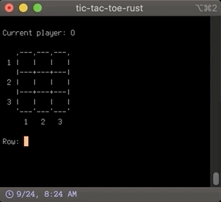

# tic-tac-toe-rust

Super simple (and crappy, don't forget crappy!) tic tac toe game written in Rust.

## Why?

'Cause I haven't written anything in Rust before and I wanted to do something that kept my attention.

## Okay, but why do _I_ need to see this?

Oh, you don't.

## ...but why is it, like, licensed MIT and in a public repo?

Vanity, I guess?

## How can it be vanity if you, yourself, said it was crappy?

Okay, well, maybe I don't think it's, like, 100% crappy. I'm still proud of it.

## But you barely knew what you were doing and it shows

All right, that's just

## I mean, sometimes you just added ampersands in front of things that weren't working and

Yeah look I'm not trying to defend this

## kept going without actually figuring out what

dumb little "Hello, World!" project, it's

## is actually happening... like why wouldn't

really mostly just a learning

## you at least look up

experience and I'm just starting

## concepts you don't get at the _moment_ you encounter

to grok things, really.

## them? It's the best way to learn, IMO.

Sorry, what were you saying? I missed it.

## What?

You were saying something.

## Oh, right. No worries; nothing important.

Cool.

## So... you gonna show me how it works, or what?

Oh, yeah, sure. Check it out:

Dunno if that's up to date, though. Might have worked on it a bit since I uploaded that.

## Neat.

Right? I think it's kinda cool.

## Well... I gotta go, stuff to do.

I don't believe it.

## Jesus Christ I'm leaving

Cool cool.
